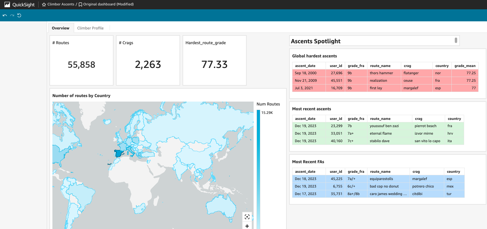

# DBT Climbs Project
A project using dbt on AWS Athena for Climbing data.



## Development
#### Prerequisites:
- Python ~3.12
- uv

#### Virtual env setup
The uv installer automatically uses the uv.lock file to install the exact versions of all packages and their sub-dependencies.
```
uv venv
source .venv/bin/activate
uv pip install
```

#### dbt

To load seed data into tables:
`dbt seed`


To create lineage diagram:
`dbt docs generate && dbt docs serve`
